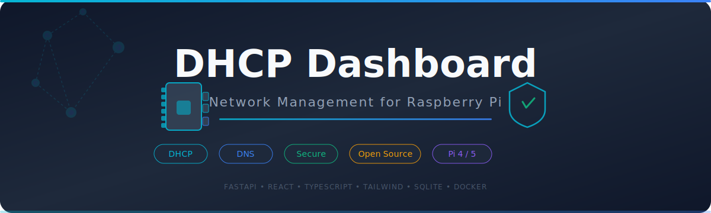
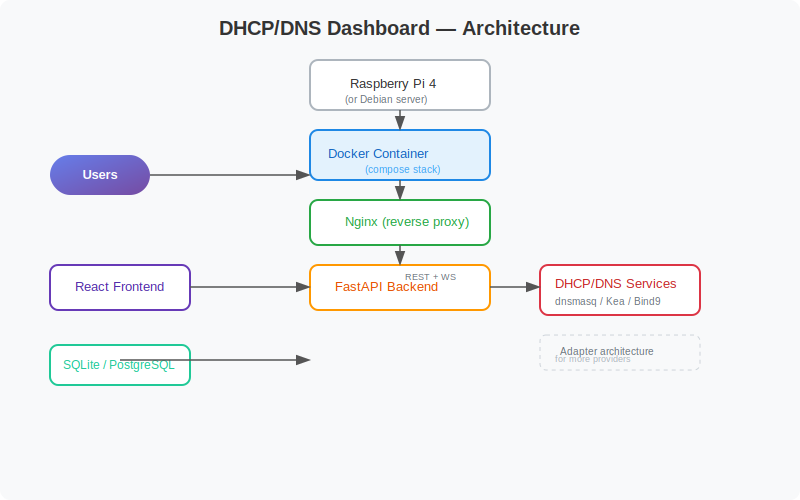

<p align="center">
  
</p>

<p align="center">
  <strong>A modern, web-based DHCP & DNS management dashboard for your Raspberry Pi</strong>
</p>

<p align="center">
  <a href="https://python.org"></a>
  <a href="https://fastapi.tiangolo.com"></a>
  <a href="https://react.dev"></a>
  <a href="https://www.typescriptlang.org"></a>
  <a href="https://tailwindcss.com"></a>
  <a href="https://www.raspberrypi.com"></a>
  <a href="LICENSE"></a>
</p>

---

## 📖 Table of Contents

- [✨ Features](#-features)
- [🧰 Tech Stack](#-tech-stack)
- [📸 Screenshots](#-screenshots)
- [🚀 Quick Start](#-quick-start) *(for testing)*
- [📦 Full Raspberry Pi Installation](#-full-raspberry-pi-installation)
- [🎮 Managing the Dashboard](#-managing-the-dashboard)
- [🔐 Default Credentials](#-default-credentials)
- [📁 Project Structure](#-project-structure)
- [🤝 Contributing](#-contributing)
- [📄 License](#-license)

---

## ✨ Features

### 🖥️ Dashboard

- Real‑time monitoring with **WebSocket** updates every few seconds
- **9 stat cards**: DHCP status, DNS status, uptime, CPU, RAM, disk, active clients, leases, query rate
- **Time‑series charts**: system load, network throughput, DNS queries/sec, cache hit ratio
- Beautiful **glassmorphism** UI with dark & light mode

### 🌐 DHCP Management

- View all active leases with search & filter
- Lease history & expiration tracking
- Add / Edit / Delete static reservations
- MAC address lookup with **vendor detection**
- IP range management

### 📡 DNS Management

- Full zone management (add, edit, delete zones)
- Edit all common record types: **A, AAAA, CNAME, MX, TXT, SRV, PTR**
- Bulk import / export of records
- DNS validation & zone backup

### 👥 Client Inventory

- Every device connected is tracked:
  - Hostname, IP, MAC, Vendor, Last Seen, Lease Status
  - OS detection, connection history

### 🔔 Alerts & Notifications

- Configurable alerts for:
  - DHCP pool exhaustion, service failures, high CPU/memory, DNS errors, unknown devices
- Delivery via **Email, Webhooks, Discord, Slack**

### 📋 Audit Trail

- Every action is logged: logins, config changes, DHCP/DNS modifications, security events
- Filterable log viewer with **CSV export**

## 🗺️ Architecture



### 🔒 Security

- JWT authentication + secure session management
- Role‑based access control: Admin, Operator, Read‑Only
- CSRF protection, rate limiting, Argon2 password hashing
- Follows OWASP best practices

---

## 🧰 Tech Stack

| Layer        | Technology |
|-------------|-----------|
| **Backend**  | Python 3.12+, FastAPI, SQLAlchemy, JWT, SQLite/PostgreSQL |
| **Frontend** | React 19, TypeScript, Vite, shadcn/ui, Tailwind CSS v4 |
| **Charts**   | Recharts |
| **State**    | TanStack Query |
| **Forms**    | react‑hook‑form + Zod validation |
| **Icons**    | Lucide |
| **Deployment** | Docker, Docker Compose, Nginx, systemd |

---

## 📸 Screenshots

> *Coming soon! Take a peek at the clean glassmorphism interface.*

---

## 🚀 Quick Start

Try the dashboard on any Linux machine in 2 minutes:

```bash
# Clone the repo
git clone https://github.com/jphermans/dhcp-dashboard.git
cd dhcp-dashboard

# Start the backend (in terminal 1)
cd backend
python3 -m venv venv
source venv/bin/activate
pip install -r requirements.txt
cp .env.example .env    # or set your own values
python -m uvicorn app.main:app --host 0.0.0.0 --port 8000

# Start the frontend (in terminal 2)
cd ../frontend
npm install
npm run dev
```

Open **http://localhost:5173** and log in with `admin` / `admin123`.

The frontend automatically proxies API calls to the backend on port 8000.

---

## 🖥️ Prepare the Raspberry Pi

Before installing the dashboard, you need a Raspberry Pi running **Raspberry Pi OS (64‑bit)** (formerly Raspbian). Choose the method that fits your comfort level:

### 🟢 Beginner: Raspberry Pi Imager *(recommended)*

Raspberry Pi Imager is the official, easiest way to write the OS — no command line needed.

1. **Download Raspberry Pi Imager** from [raspberrypi.com/software](https://www.raspberrypi.com/software/) (Windows, macOS, Linux).
2. **Insert** your microSD card into your computer (use a USB card reader if needed).
3. **Open Raspberry Pi Imager** and:
   - **Choose Device**: Select your Pi model (e.g., Raspberry Pi 4, Pi 5).
   - **Choose OS**: Pick **Raspberry Pi OS (64‑bit)** — the **Lite** version is best for a headless server (no desktop).
   - **Choose Storage**: Select your microSD card.
4. **Click** ⚙️ (gear icon) to pre‑configure:
   - ☑ **Set hostname**: e.g., `dhcpdashboard.local`
   - ☑ **Enable SSH** (use password or public key)
   - ☑ **Configure wireless LAN** (SSID + password)
   - ☑ **Set username and password** (default `pi`/`raspberry` is insecure)
5. **Click WRITE** — the tool downloads the image, writes it, and verifies it automatically.
6. **Insert** the card into your Pi, connect power, and wait 1–2 minutes for the first boot.

### 🟡 Alternative: balenaEtcher

[balenaEtcher](https://www.balena.io/etcher/) is another simple GUI tool:
1. **Download** the Raspberry Pi OS `.img.xz` file from [raspberrypi.com/software/operating-systems](https://www.raspberrypi.com/software/operating-systems/).
2. **Flash** the image with Etcher. It verifies automatically.
3. For headless setup, create a file named `ssh` (no extension) on the `boot` partition and a `wpa_supplicant.conf` (instructions below).

### 🔴 Advanced: Command Line (`dd`)

If you prefer the terminal:

```bash
# 1. Download latest Raspberry Pi OS Lite 64-bit
wget https://downloads.raspberrypi.com/raspios_lite_arm64/images/raspios_lite_arm64-2024-11-19/2024-11-19-raspios-bookworm-arm64-lite.img.xz

# 2. Identify your SD card (e.g., /dev/sdb) — WARNING: double‑check or you'll nuke your drive!
lsblk

# 3. Write the image (replace /dev/sdX with YOUR device)
xzcat 2024-11-19-raspios-bookworm-arm64-lite.img.xz | sudo dd of=/dev/sdX bs=4M status=progress
sync
```

> ⚠️ **Critical**: Replace `/dev/sdX` with your actual SD card device (e.g., `/dev/sdb`, `/dev/mmcblk0`). Using the wrong device **will destroy all data on that drive**. Double‑check with `lsblk`.

### Headless Setup (No Monitor / Keyboard)

If you're running the Pi without a display:

- **Enable SSH**: After writing the image, mount the `boot` partition and create an empty file named `ssh` (no extension):
  ```bash
  touch /media/$USER/boot/ssh
  ```
- **Configure Wi‑Fi**: While the `boot` partition is still mounted, create `wpa_supplicant.conf`:
  ```bash
  cat > /media/$USER/boot/wpa_supplicant.conf << 'EOF'
  country=US
  ctrl_interface=DIR=/var/run/wpa_supplicant GROUP=netdev
  update_config=1
  
  network={
      ssid="YourWiFiSSID"
      psk="YourWiFiPassword"
  }
  EOF
  ```
  The OS will copy these files and connect automatically on first boot.

Once the Pi boots, find its IP (`ping dhcpdashboard.local` or check your router's DHCP table) and **SSH in**:
```bash
ssh <username>@<pi-ip-address>
```

Now you're ready to install the dashboard! 👇

---

## 📦 Full Raspberry Pi Installation

Designed for **Raspberry Pi 4/5** (and any Debian‑based system).

### ☁️ Option 1: One‑command install (recommended)

No cloning required — the script fetches everything automatically:

```bash
curl -sSL https://raw.githubusercontent.com/jphermans/dhcp-dashboard/main/scripts/install_dashboard.sh | bash
```

> **💡 How it works:** The script detects it's running standalone, downloads the full project to a temp directory, and runs itself from there. Your system stays clean — nothing is left in `/tmp` after the install.

### 📥 Option 2: Clone and install manually

Prefer to inspect the code first?

```bash
git clone https://github.com/jphermans/dhcp-dashboard.git
cd dhcp-dashboard
./scripts/install_dashboard.sh
```

The script will:

- 🔄 Update your system
- 📦 Install all required packages (Python 3, Node.js 20, Nginx, build tools)
- ⚙️ Ask you for the server IP, ports, admin username & password
- 🐍 Create a Python virtual environment and install the backend
- ⚛️ Build the frontend for production
- 🖥️ Configure Nginx as a reverse proxy
- 🔁 Create a systemd service so the dashboard starts on boot
- ✅ Perform a final health check

You'll see colourful progress bars, spinners, and success messages!

### 3️⃣ Access the dashboard

Open your browser and go to:

```
http://<your-raspberry-pi-ip>
```

The backend API and Swagger docs are available at:

```
http://<your-raspberry-pi-ip>:8000/api/docs
```

### 4️⃣ (Optional) Enable auto‑start on boot

The installer already created the systemd service, but you can double‑check with:

```bash
sudo systemctl enable --now dhcpdashboard-backend
```

---

## 🎮 Managing the Dashboard

Use the handy **`dashboardctl.sh`** script to control the dashboard:

```bash
# Start both backend and nginx
sudo ./scripts/dashboardctl.sh start

# Stop gracefully
sudo ./scripts/dashboardctl.sh stop

# Restart with health check
sudo ./scripts/dashboardctl.sh restart

# See detailed status (services, health, logs)
sudo ./scripts/dashboardctl.sh status

# Enable / disable auto‑start on boot
sudo ./scripts/dashboardctl.sh enable
sudo ./scripts/dashboardctl.sh disable
```

---

## 🔐 Default Credentials

| Field    | Value       |
|----------|-------------|
| Username | `admin`     |
| Password | `admin123`  |

⚠️ **Change the password immediately** after installation!

You can change it from the **Settings** page in the dashboard.

---

## 📁 Project Structure

```
dhcp-dashboard/
├── backend/            # Python FastAPI backend
│   ├── app/
│   │   ├── api/        # REST endpoints (auth, dashboard, dhcp, dns, alerts, etc.)
│   │   ├── core/       # Configuration, security
│   │   ├── db/         # Database models & session
│   │   └── main.py     # Entry point
│   ├── data/           # SQLite database (gitignored)
│   └── requirements.txt
├── frontend/           # React 19 + TypeScript frontend
│   ├── src/
│   │   ├── pages/      # 8 page components (Login, Dashboard, DHCP, DNS, Clients, Alerts, Audit, Settings)
│   │   ├── components/ # shadcn/ui components, layout, auth wrappers
│   │   ├── contexts/   # Authentication & Theme contexts
│   │   ├── lib/        # API client, utilities
│   │   └── types/      # TypeScript interfaces
│   ├── public/
│   └── vite.config.ts
├── scripts/
│   ├── install_dashboard.sh   # 🎨 Colorful automatic installer
│   └── dashboardctl.sh        # 🎮 Start / stop / status manager
└── README.md
```

---

## 📡 Standalone DHCP & DNS Server

Additionally, the project includes a **separate installer** for setting up a **standalone DHCP & DNS server** (powered by `dnsmasq`) on your Raspberry Pi — ideal when your router acts only as a gateway and does not provide DHCP.

### 🧪 Dry‑Run Testing

Test the script without making any changes:

```bash
chmod +x scripts/install_dhcp_dns.sh
./scripts/install_dhcp_dns.sh --test
```

This simulates every step with a colorful UI — perfect for verifying the flow in an LXC container before a real installation.

### 🚀 Real Installation

```bash
sudo ./scripts/install_dhcp_dns.sh
```

The interactive installer asks for network settings (IP, CIDR, gateway, DHCP range, domain, upstream DNS) and then:

- Installs and configures `dnsmasq`
- Sets a static IP on the Pi
- Opens firewall ports
- Enables the service to start on boot

> ℹ️ For a detailed walkthrough, check the **Obsidian note** inside the vault:
> `20-Knowledge/Networking/Raspberry Pi DHCP and DNS Setup.md`

---

## 📚 DOX Documentation

This project uses the **[DOX framework](https://github.com/agent0ai/dox)** to document its codebase for AI agents. Every code folder contains an `AGENTS.md` file that serves as a binding work contract for its subtree, describing purpose, ownership, local contracts, work guidance, and verification rules.

| Folder | DOX Contract |
|--------|-------------|
| `scripts/` | Installer scripts & security rules |
| `frontend/` | React 19 + TypeScript UI conventions |
| `backend/` | FastAPI REST API & WebSocket standards |
| `docker/` | Docker & Compose deployment rules |
| `docs/` | User & developer documentation |

> 💡 **TL;DR:** DOX ensures every AI agent working on this project follows the same rules and standards.

---

## 🤝 Contributing

Contributions are welcome! Feel free to:

- Open an **issue** for bugs or feature requests
- Submit a **pull request** with improvements
- Share your **screenshots** and **feedback**

---

## 📄 License

This project is licensed under the **MIT License** – see the [LICENSE](LICENSE) file for details.

---

<p align="center">
  Made with ❤️ for home‑lab enthusiasts and network administrators
</p>
